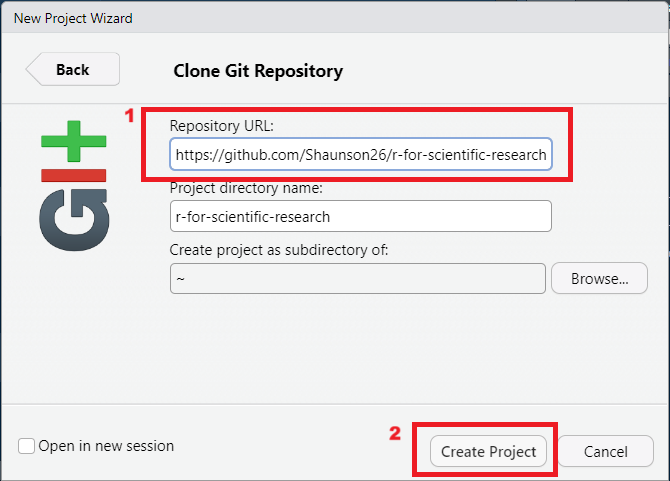
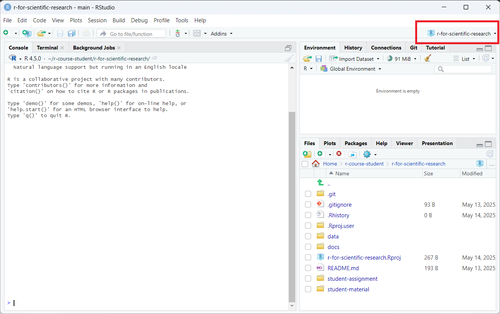

```{r, include = FALSE}
knitr::opts_chunk$set(
  collapse = TRUE,
  comment = "#>",
  fig.align = 'center'
)
```


# R for Data Analysis in Scientific Research - Madrid 2025 

<!-- badges: start -->
<!-- badges: end -->

This repository holds the course material for the R for Scientific Research - Madrid 2025.

Lecture notes are in the `lecture-notes/` folder as HTML files

Slides hosted online can be found [here](https://shaunson26.github.io/r-for-scientific-research/)

## Downloading the content from RStudio

Ensure you have R, RStudio and git installed

In RStudio, go

1. File > New Project .... 

```{r, echo = F, out.width='400px'}
knitr::include_graphics("readme-images/file-new-project.png")
```

2. Version Control

```{r, echo = F, out.width='400px'}
knitr::include_graphics('readme-images/version-control.png')
```
<br>

3. Git

```{r, echo = F, out.width='400px'}
knitr::include_graphics('readme-images/git.png')
```
<br>

4. In the Repository URL, add
  - `https://github.com/Shaunson26/r-for-scientific-research`
  - Create Project
  
```{r, echo = F, out.width='400px'}

```
<br>

5. RStudio should load the project.
  - Make sure you can see `r-for-scientific-research` at the top right


```{r, echo = F, out.width='600px'}

```
<br>

6. You are now ready for the course!

