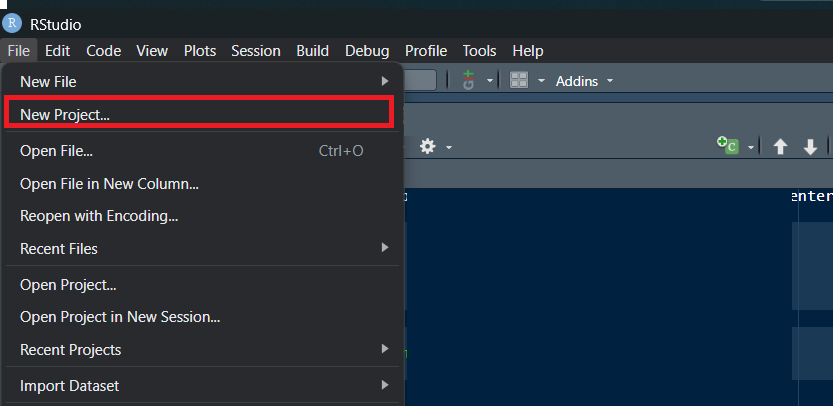

# R for Data Analysis in Scientific Research - Madrid 2025

<!-- badges: start -->
<!-- badges: end -->

This repository holds the course material for the R for Scientific
Research - Madrid 2025.

Lecture notes are in the `lecture-notes/` folder as HTML files

Slides hosted online can be found
[here](https://shaunson26.github.io/r-for-scientific-research/)

## Downloading the content from RStudio

Ensure you have R, RStudio and git installed

In RStudio, go

1.  File \> New Project …

2.  Version Control

 

3.  Git

 

4.  In the Repository URL, add

- `https://github.com/Shaunson26/r-for-scientific-research`
- Create Project

 

5.  RStudio should load the project.

- Make sure you can see `r-for-scientific-research` at the top right

 

6.  You are now ready for the course!
